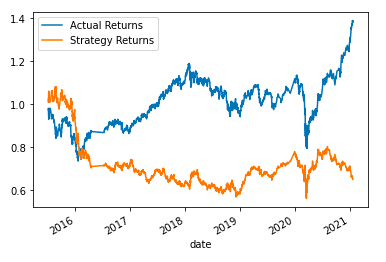
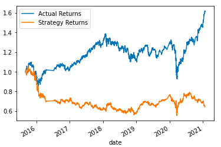
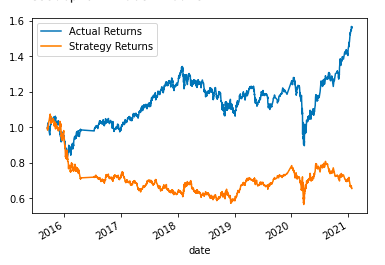
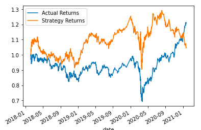

# Algorithmic_Trading
A comparison of algorithmic trading models incorporating machine learning

---

## Technologies

This application is written in Python v. 3.9.7 and uses [JupyterLab](https://jupyter.org/) to deploy the code. This application makes use of
 the following libraries:


[pandas](https://pandas.pydata.org/docs/) was used for data collection, preparation, and analysis

[numpy](https://numpy.org/doc/) was used for mathematical analysis

[hvplot](https://hvplot.holoviz.org/) was used to help plot and visualize data

[matplotlib](https://matplotlib.org/) was used to help plot and visualize data

[pathlib](https://docs.python.org/3/library/pathlib.html) was used to assist in importing and exporting data

[sklearn](https://scikit-learn.org/stable/) was used for preparing and scaling data to be used for the machine learning modeling and fitting


---

## Installation Guide

Prior to running this application, perform the following in the command line to install the required libraries:

`pip install pandas`

`pip install jupyterlab`

`pip install pathlib`

`pip install sklearn`

`pip install numpy`

`pip install hvplot`

`pip install matplotlib`


---

## Usage

In order to launch the application, navigate to the Algorithmic_Trading folder that contains all of the code for this application, and then type into the command line:

```
jupyter lab
```

Once in jupyter lab, open the machine_learning_trading_bot.ipynb and run each cell in the jupyter file to see the resulting anlysis.

---

## Model Evaluation Report

### Base Model
The base model was constructed using 4 and 100 day SMAs respectively and was trained on 3 months worth of historic data beginning in 02-03-2015. A SVM machine learning model was used to fit the data and make predictions. Through backtesting, this model showed that it yielded a cumulative return of around 70% of the starting value of the portfolio. Below is a plot of the base model's cumulative return compared to the actual returns of the historic data:



### 5 Month Training Model
This model was constructed using 4 and 100 day SMAs respectively and was trained on 5 months worth of historic data beginning in 02-03-2015. A SVM machine learning model was used to fit the data and make predictions. Through backtesting, this model showed that it yielded a cumulative return of closer to 60% of the starting value of the portfolio. Below is a plot of the base model's cumulative return compared to the actual returns of the historic data:



### 20 SMA & 200 SMA Training Model
This model was constructed using 20 and 200 day SMAs respectively and was trained on 3 months worth of historic data beginning in 02-03-2015. A SVM machine learning model was used to fit the data and make predictions. Through backtesting, this model showed that it yielded a cumulative return of closer to 60% of the starting value of the portfolio. Below is a plot of the base model's cumulative return compared to the actual returns of the historic data:



### Linear Regression Training Model
This model was constructed using 4 and 100 day SMAs respectively and was trained on 3 months worth of historic data beginning in 02-03-2015. A linear regression machine learning model was used to fit the data and make predictions. Through backtesting, this model showed that it yielded a cumulative return of closer to 60% of the starting value of the portfolio. Below is a plot of the base model's cumulative return compared to the actual returns of the historic data:


### Optimized Training Model
This model was constructed using 3 and 25 day SMAs respectively and was trained on 36 months worth of historic data beginning in 02-03-2015. A SVM machine learning model was used to fit the data and make predictions. Through backtesting, this model showed that it yielded a cumulative return of around to 105% of the starting value of the portfolio. Below is a plot of the base model's cumulative return compared to the actual returns of the historic data:



### Conclusion

Through the many different models that were run, it appears that small changes in the amount of months the models were trained on or the number of days in the short and long SMAs did not yield much of a difference from the base model. However, as is apparent in the optimized model, when the model was trained on years worth of data (rather than a few months) and the separation in short and long SMAs was low, the model performed vastly better than the original model, even outperforming the actual returns most of the time in backtesting.

---

## Contributors

Robby Odum

Email: rodum012@gmail.com

---

## License

MIT